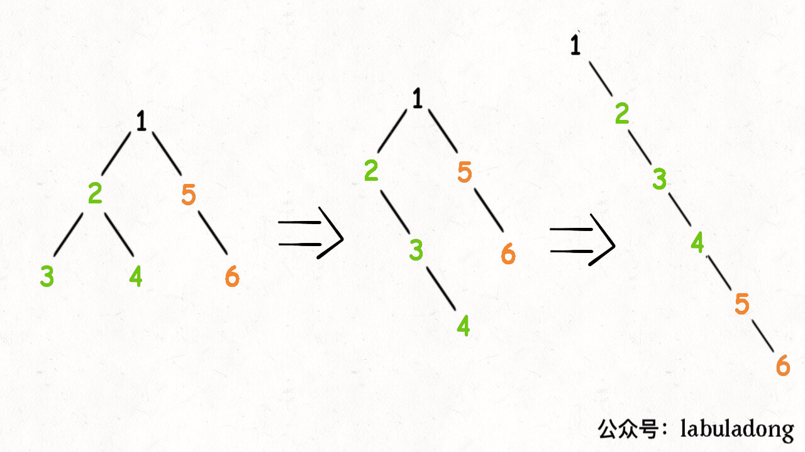

#114
我们尝试给出这个函数的定义：

给 flatten 函数输入一个节点 root，那么以 root 为根的二叉树就会被拉平为一条链表。   

我们再梳理一下，如何按题目要求把一棵树拉平成一条链表？很简单，以下流程：  

1、将 root 的左子树和右子树拉平。  

2、将 root 的右子树接到左子树下方，然后将整个左子树作为右子树。  

上面三步看起来最难的应该是第一步对吧，如何把 root 的左右子树拉平？其实很简单，按照 flatten 函数的定义，对 root 的左右子树递归调用 flatten 函数即可： 

你看，这就是递归的魅力，你说 flatten 函数是怎么把左右子树拉平的？说不清楚，但是只要知道 flatten 的定义如此，相信这个定义，让 root 做它该做的事情，然后 flatten 函数就会按照定义工作。另外注意递归框架是后序遍历，因为我们要先拉平左右子树才能进行后续操作。
